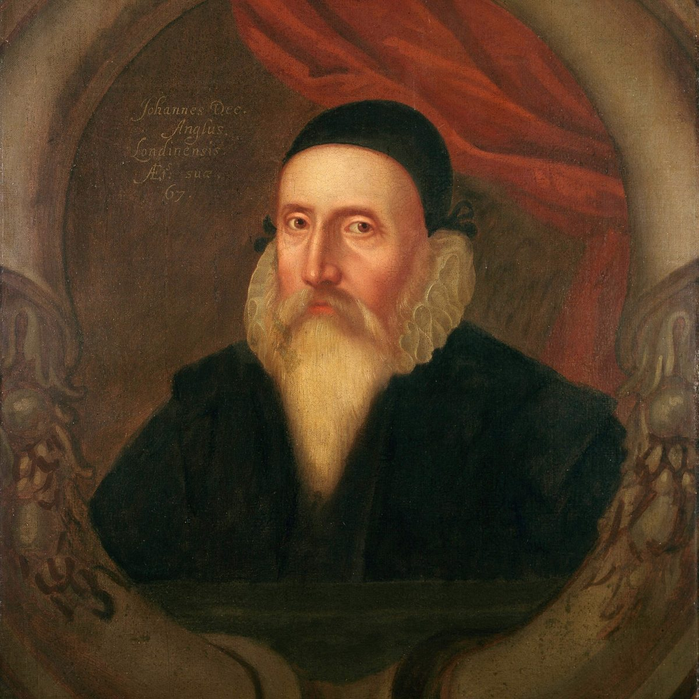

# Imperial Magus — a John Dee Visual Novel

**▶ Play it: https://t3dy.github.io/DeeVisualNovel/**

**📜 The Dee Portal (research companion): https://t3dy.github.io/DeeVisualNovel/portal/**

**😇 Play the other side: [Spoken Backward](AngelPOV/) — https://t3dy.github.io/DeeVisualNovel/AngelPOV/
— the same twenty-seven years from inside the shew-stone, where you are the angels, John
Dee is the instrument, and the empire you want has no preferred nationality.**

**📚 Deeper reference — [The John Dee Summary Browser](https://t3dy.github.io/JohnDeeSummaries/)
(1,800+ pages over the full corpus) · [RenaissanceMagicDB](https://t3dy.github.io/RMDB/)
(337 documents, 48 figures, the whole tradition).**



*John Dee, by an unknown artist, c. 1594. Ashmolean Museum, Oxford.*

## What this is

A historically grounded visual novel about **John Dee (1527–1608/09)** — mathematician to
a queen, owner of the greatest library in England, and, depending entirely on who is
speaking, either the age's most ambitious natural philosopher or its most notorious
conjuror. Forty choices across eight acts of the documented life: the Star Chamber, the
coronation election, the *Monas Hieroglyphica* set in metal at Antwerp, Mortlake and its
four thousand volumes, the shew-stone and Edward Kelley, the crossing to Bohemia, Třeboň,
the return to a stripped house, and the petition to be tried that was refused.

**The structural idea:** Dee survives his one real tribunal early (1555), and is then
destroyed by the *absence* of one — a slander no argument reaches, ending in the 1604–05
petition to King James asking to be formally tried so the "conjuror" label can be answered
at law. It is refused. A charge can be answered; a stain cannot.

**The epistemic rule:** the game never states whether the angels were real. Every
consequence reports only what happened socially and materially. Everything arrives through
Edward Kelley, and every choice about the messages is also a choice about the man.

## How it plays

```
TITLE → ACT INTRO → CHOICE → CONSEQUENCE → … → ENDING (+ the Catalogue)
```

- **Marginalia interface** — consequence text is Dee's own annotation in a second ink;
  Dee was the most famous annotator in the history of English books, and his surviving
  volumes are studied for their margins.
- **Grounding marks on every scene** — *the record holds this · the record is silent
  here · so it was later told · so it might have been* — so the game is always honest
  about the difference between document, gap, legend, and counterfactual.
- **Seven capabilities as verbs** (calculate, predict, experiment, invoke, navigate, map,
  persuade) that unlock different ways of seeing a situation — never "correct answers."
- **Three hidden states** (angelic authority, scholarly credibility, political utility)
  that are never displayed: you cannot optimize what you cannot see.
- **Eight endings**, computed from the whole life. The documented history is one among
  them, unprivileged. One — the Ottoman route east, after Melvin-Koushki's counterfactual
  in *Hellebore* (2021) — is played under an explicit *so it might have been* mark.
- **The ending is a library catalogue** — the run's choices shelved under *What He Asked ·
  Whom He Told · What He Kept · What Was Promised · What Was Scattered*.
- Keyboard: number keys choose, Enter/Space continues. A run is 8–12 minutes,
  deliberately — divergence only matters if you replay.

## Research grounding

Built against a corpus of the Dee scholarship — **Parry** (*The Arch-Conjuror of
England*), **Harkness** (*John Dee's Conversations with Angels*), **Clulee**, **Sherman**,
**Szőnyi**, **Håkansson**, **Clucas**, **Forshaw**, **Walton**, **Whitby** — plus the
primary sources (the *Mysteriorum Libri*, Casaubon's 1659 *True & Faithful Relation*, the
day books, the *Monas*). The research documents ship in [`docs/`](docs/):

| Document | What it is |
|---|---|
| [BIOGRAPHY.md](docs/BIOGRAPHY.md) | The claim-tagged life, with page-range citations |
| [HISTORIOGRAPHICAL_ISSUES.md](docs/HISTORIOGRAPHICAL_ISSUES.md) | The ten arguments scholars have about Dee, each mapped to the game node that dramatises it |
| [LEAD_VERIFICATION.md](docs/LEAD_VERIFICATION.md) | 38 claims checked against the corpus, with excerpts |
| [DAYBOOK_TEXTURE.md](docs/DAYBOOK_TEXTURE.md) | 1,464 private-diary entries mined by theme |
| [NARRATIVE_DESIGN.md](docs/NARRATIVE_DESIGN.md) · [CHOICE_ARCHITECTURE.md](docs/CHOICE_ARCHITECTURE.md) · [WRITING_GUIDE.md](docs/WRITING_GUIDE.md) | The design record |

The governing design rule: **where the scholarship is unresolved, the game does not
resolve it — it makes the player enact it.**

## Images

Every image ships with a provenance record ([`assets/registry.json`](assets/registry.json),
browsable at [portal/images.html](https://t3dy.github.io/DeeVisualNovel/portal/images.html)) —
all public domain or CC0: the Ashmolean portrait, the obsidian mirror and shew-stone
(British Museum), the Sigillum Dei Aemeth in Dee's hand (Sloane MS 3188), the 1564 *Monas*
title page, the Enochian letters, and the Casaubon Holy Table. The act-marks are original
line drawings of Dee's own geometry — rationale in
[assets/DIAGRAMS.md](assets/DIAGRAMS.md).

## Run locally / verify

No build step. Serve the folder and open `index.html`:

```bash
python -m http.server 8080
```

```bash
node tools/sim.mjs dee     # headless playthroughs: every strategy completes, all 8 endings reachable
node tools/dist.mjs dee    # ending distribution over 3,000 random runs
node tools/lint.mjs dee    # content checks (word-count anchors, no unverified material ships)
```

## Series context

This is the first sequel to [TurkaGame](https://github.com/t3dy/TurkaGame) — a visual
novel about Ṣāʾin al-Dīn ibn Turka, the Timurid occult philosopher — in a planned
**Renaissance Magic** series (Dee, Bruno, Agrippa, Trithemius, Paracelsus). The pairing is
the scholarship's own: "Ibn Turka is best approached as a Timurid Dr. Dee — or Dee best
approached as an Elizabethan Dr. Littleturk" (Melvin-Koushki). The canonical development
workspace is `VisualNovels/`; this repository is its generated deploy artifact — see
[DEPLOY_STATE.md](DEPLOY_STATE.md).

---

*Made with the scholarship of others and the record Dee kept himself. Where it is wrong,
the margins are open.*
